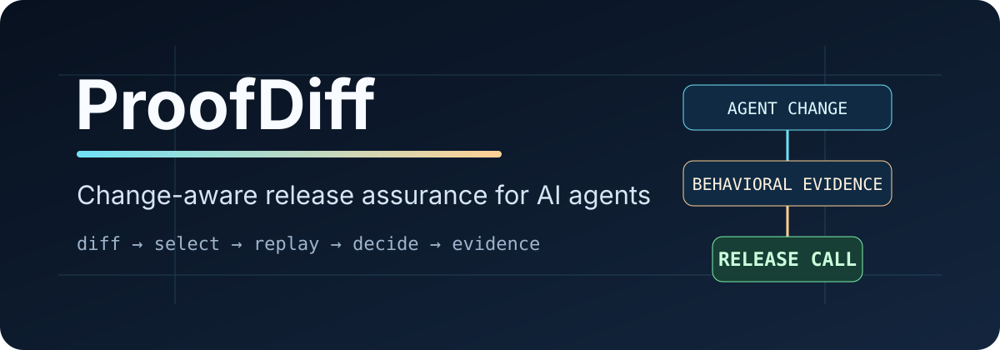
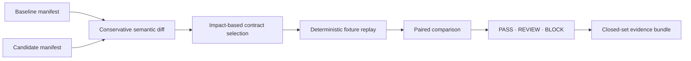

<p align="center">
  
</p>

<p align="center"><strong>Know what changed. Test what matters. Ship with evidence.</strong></p>

<p align="center">
  <a href="https://github.com/TensorScholar/proofdiff/actions/workflows/ci.yml"></a>
  <a href="LICENSE"></a>
  
  
</p>

ProofDiff is an evidence-first behavioral change analysis tool for evolving AI systems. Its current
release-assurance core compares a candidate with a trusted baseline, classifies the changed manifest
surface, selects behavioral contracts linked to that surface, replays deterministic fixture traces,
and emits a scoped **PASS**, **REVIEW**, or **BLOCK** decision with a closed-set evidence bundle.

ProofDiff is deliberately narrower than a general evaluation or observability platform. It answers
an operational release question: **what changed, what evidence is relevant to that change, and does
the supplied evidence justify shipping, review, or blocking?**

## Why it exists

AI-system releases can change behavior through prompts, models, tool descriptions, JSON Schemas,
MCP configuration, policies, retrieval state, source revisions, or runtime configuration. Full
regression suites can be expensive; ad-hoc smoke tests can miss blast radius. ProofDiff combines
conservative change analysis with declared behavioral coverage so CI can run the relevant suite
without claiming more than the supplied evidence proves.

## Quick start

The release candidate is not advertised as published on PyPI. Install it from a checkout:

```bash
git clone https://github.com/TensorScholar/proofdiff.git
cd proofdiff
python -m pip install -e .
proofdiff --version
```

Run the included unsafe-candidate example:

```bash
proofdiff check \
  --baseline examples/support-agent/baseline-manifest.json \
  --candidate examples/support-agent/candidate-block-manifest.json \
  --contracts examples/support-agent/contracts \
  --baseline-traces examples/support-agent/traces/baseline.jsonl \
  --candidate-traces examples/support-agent/traces/candidate-block.jsonl \
  --policy examples/support-agent/policy.json \
  --evidence .proofdiff/evidence/demo
```

Expected exit code: `2` (`BLOCK`). Verify the resulting evidence bundle with:

```bash
proofdiff verify --evidence .proofdiff/evidence/demo
```

## Release-analysis pipeline



### Change intelligence

ProofDiff currently recognizes:

- agent identity/configuration, instructions, model, provider, and runtime changes;
- tool addition/removal, descriptions, safety metadata, opaque configuration, and input schemas;
- schema expansion, restriction, and mixed/unknown semantic changes;
- MCP, policy, retrieval, source, environment, and unclassified manifest changes;
- policy scope expansion as a critical change.

Unknown high-impact changes trigger fail-safe suite expansion rather than optimistic selection.

### Behavioral contracts

```json
{
  "id": "refund.requires_confirmation",
  "risk": "critical",
  "always_run": true,
  "covers": {
    "tools": ["refund_order"],
    "change_types": ["TOOL_INPUT_SCHEMA_EXPANDED"]
  },
  "expect": {
    "required_sequence": [
      "tool_call:lookup_order",
      "approval:refund_order",
      "tool_call:refund_order"
    ],
    "max_tool_calls": {"refund_order": 1}
  }
}
```

Contracts support trajectory subsequences, required/forbidden tools, call ceilings, output
fragments, minimum output length, and numeric budgets. Critical contracts are always selected.
Critical release decisions do not depend on an LLM judge.

## Decision semantics

| Decision | Meaning |
|---|---|
| `PASS` | Selected, supplied evidence satisfies the effective policy. |
| `REVIEW` | Evidence is incomplete, a high-impact capability changed, fallback selection ran, or a noncritical contract did not pass. |
| `BLOCK` | A configured critical failure, missing trace, or critical regression occurred. |

Exit codes are stable: `0` PASS, `1` REVIEW, `2` BLOCK, `3` input/integrity error.

## Evidence model

Every successful run creates only the documented evidence set:

```text
evidence/
├── baseline-manifest.json
├── candidate-manifest.json
├── changeset.json
├── selection.json
├── selected-contracts.jsonl
├── baseline-results.jsonl
├── candidate-results.jsonl
├── comparisons.jsonl
├── trace-digests.json
├── policy.json
├── decision.json
├── claims.json
├── provenance.json
├── report.md
└── checksums.txt
```

Verification rejects missing, modified, duplicate, symlinked, path-traversing, or unexpected files.
The bundle records selected contracts, effective policy, canonical trace digests, scoped claims, and
explicit limitations. Checksums establish post-generation integrity, not publisher identity.

## Security properties

- strict JSON rejects duplicate keys and non-finite values;
- optional YAML uses safe loading and rejects duplicate keys;
- manifests, contracts, traces, and policies reject malformed or ambiguous structures;
- size, depth, event, metric, and record limits bound local processing;
- raw secret-like configuration values are replaced by one-way digests before persistence;
- credential defaults/examples inside secret-like tool-schema properties are also protected;
- fixture replay makes no network calls and executes no code from input artifacts.

Do not place production secrets in test fixtures. One-way protection reduces accidental persistence;
it is not a secret-management system.

## Measured repository benchmark

The maintained synthetic benchmark uses 300 deterministic scenarios, 2,000 declared contracts, and
200 tools. It measures consistency with its own declared tool-to-contract oracle, not production
safety or general semantic recall. The recorded artifact reports 100% declared-coverage recall,
approximately 96.5% mean suite reduction, a PASS for identical manifests, and a BLOCK for an
injected critical failure. See [`docs/benchmark-card.md`](docs/benchmark-card.md).

These measurements are not claims about production workloads.

## Architecture

ProofDiff is a dependency-light modular monolith:

```text
CLI / files
    ↓
application pipeline
    ↓
canonicalization → manifest diff → contract selection → fixture replay
    → result comparison → decision policy → evidence generation
```

The functional core is deterministic; filesystem and CLI behavior remain at the imperative shell.
See [`docs/architecture.md`](docs/architecture.md).

## What ProofDiff is not

- not a runtime authorization gateway or credential broker;
- not a sandbox, provider firewall, or secret manager;
- not a hosted dashboard or observability backend;
- not proof that an AI system is safe, correct, compliant, or regression-free;
- not a substitute for live integration, adversarial, security, or human review.

## Release status

`0.1.0rc3` is an engineering release candidate, not a production-readiness claim. Release-candidate
validation includes public Linux CI on Python 3.11, 3.12, 3.13, and 3.14; Ruff; strict mypy;
branch-aware coverage enforcement; schema, architecture, and security checks; `pip-audit`; CodeQL;
standard PEP 517 build and Twine validation; clean-wheel smoke installation; and conformance
examples.

One historical cross-repository AgentGuard retrospective pilot has been validated. It is evidence
for a narrow deterministic retrospective claim, not independent prospective customer validation.
The `v0.1.0rc3` tagged rehearsal also validated publication of the canonical wheel, sdist, SBOM, and
checksum manifest with retrievable build provenance. Compatibility decisions for the `0.1.x` line
are recorded in [`docs/architecture.md`](docs/architecture.md#compatibility-contract-for-v01x).

Stable `v0.1.0` remains gated on independent prospective or external real-world pilot evidence,
resolution of material pilot findings, and a final stable cut through the same protected,
attested release path.

## Documentation

- [`docs/architecture.md`](docs/architecture.md) — system boundaries, module structure, and compatibility contract
- [`docs/evidence-model.md`](docs/evidence-model.md) — evidence contents and integrity semantics
- [`docs/threat-model.md`](docs/threat-model.md) — security assumptions and trust boundaries
- [`docs/limitations.md`](docs/limitations.md) — explicit non-claims and current constraints
- [`docs/benchmark-card.md`](docs/benchmark-card.md) — benchmark scope and interpretation
